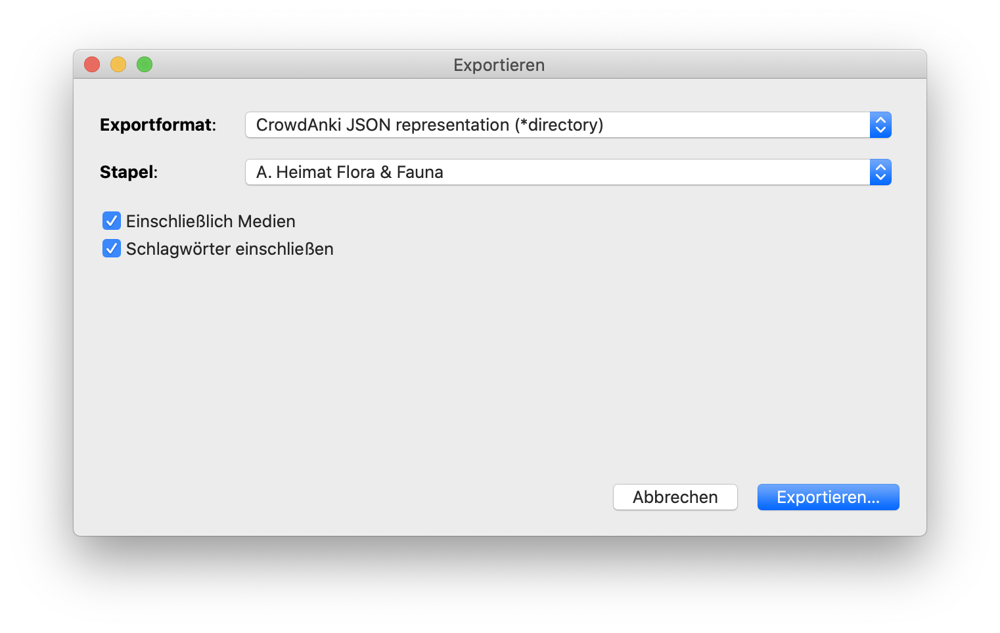
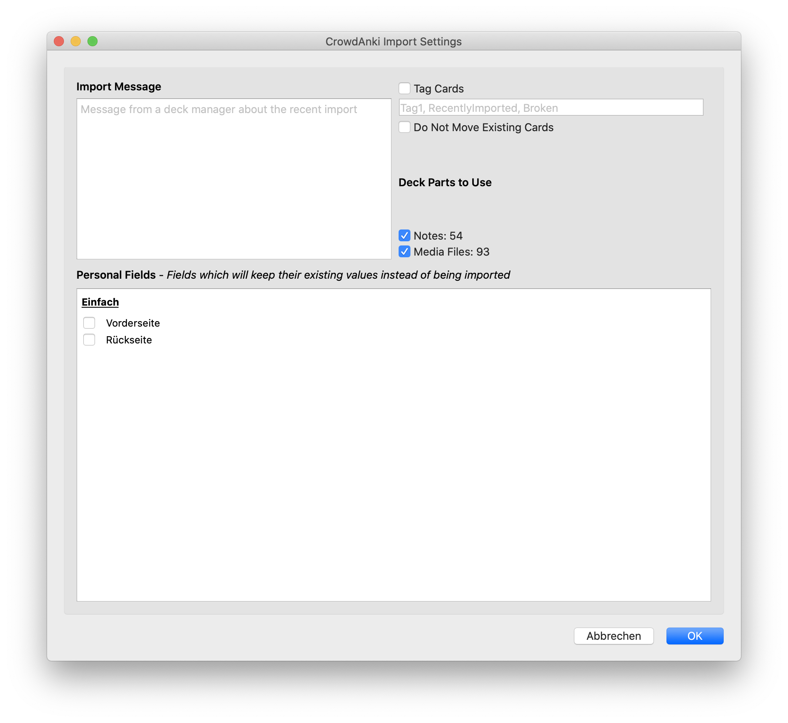

# Heimat Flora & Fauna (Anki deck)

Highly opinionated list of interesting flowers and animals. Images mostly coming from Wikipedia. Format: https://github.com/Stvad/CrowdAnki

## Export from Anki

- in Anki, open "File > Export" 
- as destination dir, select this git repo
- then, the exported content will live in a directory named like the deck is named in your Anki, however the format doesn't yet meet the git repo's format
```sh
$ cd anki-heimat-flora-fauna
$ unpack-export.sh [DIR-NAME-OF-EXPORTED-DECK] .
```

## Import from GitHub

- CrowdAnki will maintain learning progress also when a card receives an update
- in Anki, open "File > CrowdAnki: Import from git repository"
- you may use the browser url: `https://github.com/Husterknupp/anki-heimat-flora-fauna`
- you may leave the default settings 